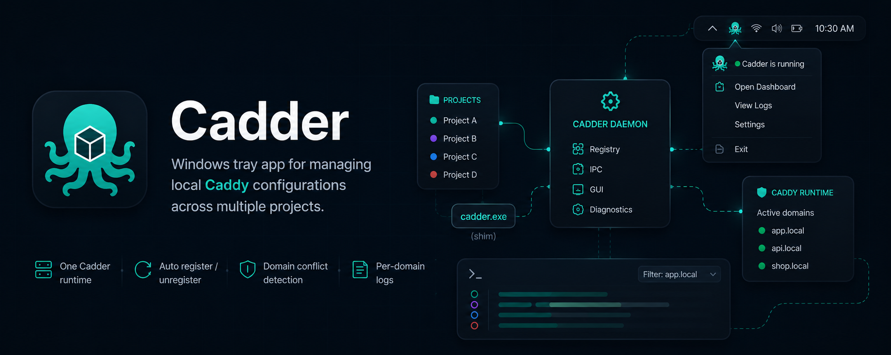

# Cadder

Cadder is a cross-platform Rust coordinator for project-local Caddy development. It lets many project `caddy run` invocations share one per-user daemon and one Cadder-owned real Caddy runtime, while keeping the Caddy-compatible shim portable and user-managed.

Cadder does not install global shims, edit PATH, create services, or modify shell profiles. You decide whether to run the binaries directly, put the shim on PATH, or copy/symlink it into a directory you already control.

## Binaries

Cadder builds three executables:

- `cadderd` is the per-user daemon. It owns local IPC, entrypoint registrations, adapted Caddy config composition, the generated effective runtime config, the real Caddy process it starts, diagnostics, and bounded log storage.
- `caddy` is the Caddy-compatible shim. For `caddy run`, it starts or connects to `cadderd`, registers the current project's Caddyfile, keeps that registration alive while the shim process runs, and unregisters on exit. Other Caddy commands are delegated to the safely resolved real Caddy binary.
- `cadder-tui` is the terminal UI. It connects to the daemon, can start it unless `--no-start` is used, and shows overview state, entrypoints, domains, per-domain logs, diagnostics, filters, toggles, log export, and daemon shutdown.

Each executable supports `--help` and `--version`. The command names, versions, and short descriptions match the Rust package metadata for the release.

The daemon owns only the real Caddy process it starts. It does not enumerate or kill unrelated Caddy processes.

## Visual assets

`assets/banner.png` and `assets/logo.png` are checked in for documentation and release pages. Cadder's runtime commands do not load these files, and the portable layout works without image assets.

## Build and validate

Use Cargo from the repository root:

```sh
cargo fmt --check
cargo clippy --workspace --all-targets -- -D warnings
cargo test --workspace
cargo run -p xtask -- check
```

`cargo run -p xtask -- check` runs the format, clippy, and workspace test checks above. Focused Cargo commands are useful while iterating, but `xtask check` is the single repository validation command for this workspace.

## Coverage

Cadder uses `cargo-llvm-cov 0.8.7` for Rust workspace coverage. On Windows, the canonical gate uses the MSVC toolchain because GNU coverage can fail without the profiler runtime:

```sh
rustup toolchain install stable-x86_64-pc-windows-msvc --profile minimal --component llvm-tools-preview
cargo install cargo-llvm-cov --version 0.8.7 --locked
```

On Linux and macOS, install the active toolchain component and the same cargo subcommand:

```sh
rustup component add llvm-tools-preview
cargo install cargo-llvm-cov --version 0.8.7 --locked
```

Run the coverage gate from the repository root:

```sh
cargo run -p xtask -- coverage
```

On Windows, the command runs:

```sh
cargo +stable-x86_64-pc-windows-msvc llvm-cov --workspace --json --summary-only --fail-under-lines 85 --output-path target/llvm-cov/coverage-summary.json
```

On other platforms, it runs:

```sh
cargo llvm-cov --workspace --json --summary-only --fail-under-lines 85 --output-path target/llvm-cov/coverage-summary.json
```

The gate fails when total line coverage is below 85% or when coverage cannot be measured, including when `cargo-llvm-cov` or the Windows MSVC toolchain is not installed. Use `cargo run -p xtask -- coverage --output <path>` to write the JSON summary somewhere other than `target/llvm-cov/coverage-summary.json`.

No project-specific coverage exclusions are configured. Future exclusions must be limited to generated, platform-gated, or intentionally untestable code and documented beside the `xtask coverage` command definition.

## Portable distribution

Build a portable layout for the current platform:

```sh
cargo run -p xtask -- dist --out .local/dist/cadder
```

The output contains:

- `cadderd`
- `cadder-tui`
- `caddy`
- `cadder.toml`

On Windows, executable files use the normal `.exe` suffix: `cadderd.exe`, `cadder-tui.exe`, and `caddy.exe`.

The `dist` command builds release binaries, copies the platform executable names into the target directory, writes a sample `cadder.toml`, and verifies the layout. It does not edit PATH, shell profiles, package-manager shims, OS services, or other system state.

Verify an existing portable layout:

```sh
cargo run -p xtask -- verify-dist --dir .local/dist/cadder
```

`verify-dist` checks the expected files and runs the layout's `caddy --cadder-shim-info` command to confirm that the copied `caddy` executable is the Cadder shim.

Build a versioned portable archive for release automation:

```sh
cargo run -p xtask -- package \
  --out artifacts \
  --version 0.1.0 \
  --platform linux-x64 \
  --target x86_64-unknown-linux-gnu
```

The package command creates `cadder-<version>-<platform>.zip` for Windows and `cadder-<version>-<platform>.tar.gz` for Linux/macOS, plus a matching `.sha256` file.

## Real Caddy resolution

Cadder never embeds Caddy. It resolves the real Caddy command in this order:

1. CLI override: `--real-caddy-command` for `cadderd` and `cadder-tui` daemon launch, or `--cadder-real-caddy-command` for the shim.
2. `[caddy].real_command` in `cadder.toml` in the current working directory.
3. `[caddy].real_command` in `cadder.toml` next to the executable.
4. Environment variables, including `CADDER_CADDY_REAL_COMMAND`.
5. A safe real `caddy` executable on PATH.

Example `cadder.toml`:

```toml
[caddy]
real_command = "/absolute/path/to/caddy"
```

The configured command can be:

- an absolute path, such as `/opt/caddy/caddy` or `C:\Tools\Caddy\caddy.exe`;
- a relative path with a path separator, such as `./tools/caddy`, resolved relative to the `cadder.toml` file that contains it;
- a plain command, such as `caddy`, resolved through PATH.

`caddy-real` is not a built-in default. It is supported only when you configure it explicitly through CLI, `cadder.toml`, or an environment variable.

## Optional PATH or shim setup

You can run the portable binaries directly:

```sh
.local/dist/cadder/cadderd
.local/dist/cadder/cadder-tui
.local/dist/cadder/caddy run
```

If you want existing `caddy run` habits to use Cadder, put the Cadder shim in a user-controlled PATH directory under the name `caddy`. These examples affect only the directories and shell state you choose.

Windows PowerShell, user directory plus current shell PATH:

```powershell
$cadder = "$HOME\bin\cadder"
New-Item -ItemType Directory -Force $cadder
Copy-Item .local\dist\cadder\caddy.exe "$cadder\caddy.exe"
$env:Path = "$cadder;$env:Path"
caddy run
```

macOS or Linux, user directory plus current shell PATH:

```sh
mkdir -p "$HOME/bin"
ln -sf "$PWD/.local/dist/cadder/caddy" "$HOME/bin/caddy"
export PATH="$HOME/bin:$PATH"
caddy run
```

You can also keep the shim under another name and call it directly. Cadder does not require a global install.

## First run workflow

1. Build from source or unpack a portable layout.
2. Configure the real Caddy command if the first safe `caddy` on PATH is not the real Caddy binary.
3. Optionally put the Cadder shim on PATH under the name `caddy`.
4. From a project directory, run `caddy run` or the portable shim path with `run`.
5. Open `cadder-tui` to inspect registrations, domains, logs, diagnostics, and toggles.
6. Stop the shim process with Ctrl+C when that project entrypoint should unregister.

See [docs/ARCHITECTURE.md](docs/ARCHITECTURE.md) for process boundaries, IPC shape, runtime ownership, and packaging details.

## Documentation site

The Astro Starlight documentation source lives in [docs/site](docs/site). Build it with Bun:

```sh
cd docs/site
bun install --frozen-lockfile
bun run check
bun run build
```

Generated output is written to `docs/site/dist` and should not be committed.
